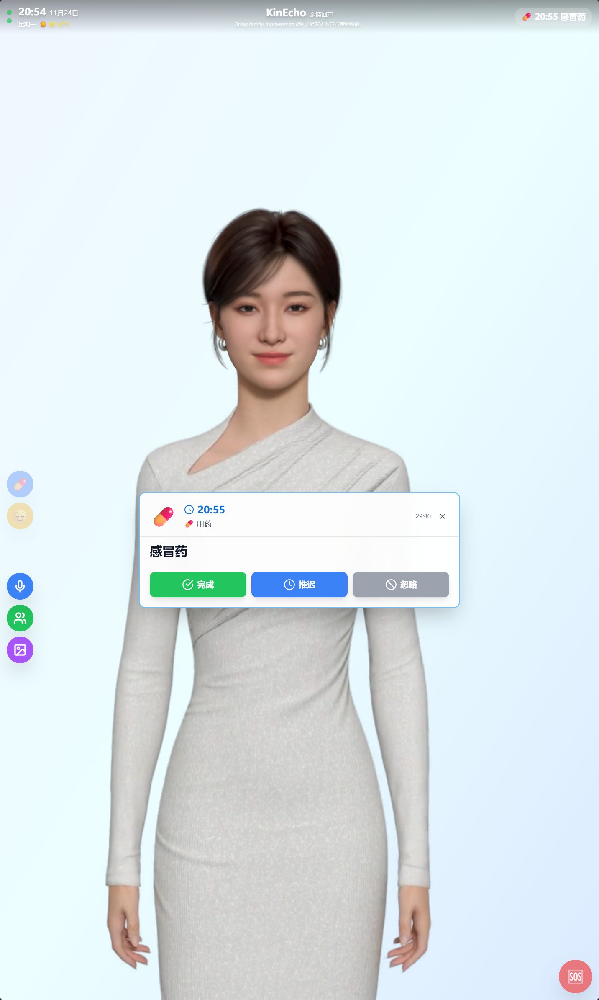
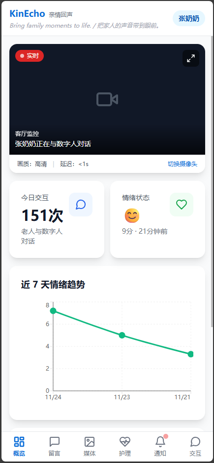
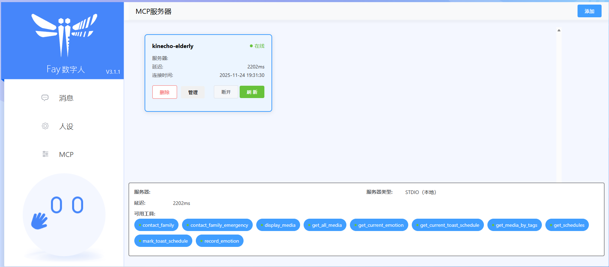

# KinEcho（亲情回声）

> "Bring family moments to life." / "把家人的声音带到眼前。"

智能老人陪伴系统 - 以老人为中心，数字人为媒介，构建的家人互动系统。

## 项目简介

KinEcho 是一个为老年人（含失能/失智）设计的智能陪伴系统，通过数字人提供日常关怀、情绪疏导、用药提醒与健康管理。家属可以上传回忆内容并在"合适的时机"播放，在风险场景下及时预警与转介。

## 使用场景

- **老人端**：**Electron 桌面应用**，在 **9:16 竖屏**上使用（如平板竖屏、竖屏显示器）
  
  - 支持桌面应用，及浏览器运行
  
  - 全屏沉浸式体验，支持 Kiosk 模式
  
  - 支持全语音操作，也适合老年人触摸操作
  
  - 可集成视觉安全监测模块
    
    

- **家属端**（护理端）：在 **手机浏览器**上使用（H5 应用）
  
  - 底部标签栏导航（类原生 App）
  
  - 单列布局，紧凑显示
  
  - 支持触摸交互
    
    

## 系统架构

```
┌─────────────────────────────────────────────────────────────────────────────┐
│                              KinEcho 系统架构                                │
└─────────────────────────────────────────────────────────────────────────────┘

┌─────────────────┐                              ┌─────────────────┐
│   Claude AI     │                              │    家属端 H5    │
│  (Claude Code)  │                              │   (手机浏览器)   │
└────────┬────────┘                              └────────┬────────┘
         │                                                │
         │ MCP Protocol                                   │ HTTP REST
         │ (stdio)                                        │
         ▼                                                │
┌─────────────────┐                                       │
│  KinEcho MCP    │                                       │
│    Server       │                                       │
│  (elderly_mcp)  │                                       │
│                 │                                       │
│ ┌─────────────┐ │                                       │
│ │ 10个AI工具   │ │                                       │
│ │ - 联系家属   │ │                                       │
│ │ - 情绪记录   │ │                                       │
│ │ - 媒体播放   │ │                                       │
│ │ - 日程管理   │ │                                       │
│ └─────────────┘ │                                       │
└────────┬────────┘                                       │
         │                                                │
         │ HTTP API                                       │
         │                                                │
         ▼                                                ▼
┌─────────────────────────────────────────────────────────────────────────────┐
│                         KinEcho Server (Flask)                              │
│                              :8000                                          │
│  ┌──────────────────────────────────────────────────────────────────────┐  │
│  │  REST API                                                             │  │
│  │  - /api/elderly/*  (老人端接口)                                       │  │
│  │  - /api/family/*   (家属端接口)                                       │  │
│  │  - /api/health     (健康检查)                                         │  │
│  └──────────────────────────────────────────────────────────────────────┘  │
│  ┌──────────────┐  ┌──────────────┐  ┌──────────────┐  ┌──────────────┐   │
│  │  情绪记录    │  │  家属告警    │  │  媒体管理    │  │  日程管理    │   │
│  │  mood_records│  │family_alerts │  │    media     │  │  schedules   │   │
│  └──────────────┘  └──────────────┘  └──────────────┘  └──────────────┘   │
│  ┌──────────────┐  ┌──────────────┐  ┌──────────────┐                     │
│  │  家属留言    │  │  播放历史    │  │  Toast通知   │  ← SSE实时推送      │
│  │family_messages│ │play_history │  │pending_toasts│                     │
│  └──────────────┘  └──────────────┘  └──────────────┘                     │
│                           │                                                │
│                           ▼                                                │
│                    ┌──────────────┐                                        │
│                    │  SQLite DB   │                                        │
│                    │ kinecho.db   │                                        │
│                    └──────────────┘                                        │
└─────────────────────────────────────────────────────────────────────────────┘
         │
         │ HTTP (媒体展示指令)
         │ POST /api/elderly/show-media
         ▼
┌─────────────────────────────────────────────────────────────────────────────┐
│                        Fay 数字人框架                                        │
│                           :5000                                             │
│  ┌──────────────────────────────────────────────────────────────────────┐  │
│  │  /transparent-pass  - AI对话透传接口                                  │  │
│  │  /audio            - 语音合成                                         │  │
│  │  /emotion          - 情绪分析                                         │  │
│  └──────────────────────────────────────────────────────────────────────┘  │
└────────┬────────────────────────────────────────────────────────────────────┘
         │
         │ WebSocket (实时驱动指令)
         │ ws://localhost:5000
         ▼
┌─────────────────────────────────────────────────────────────────────────────┐
│                         老人端 (Electron)                                    │
│                            :3000                                            │
│  ┌──────────────────────────────────────────────────────────────────────┐  │
│  │                        React + TypeScript                             │  │
│  │  ┌────────────────┐  ┌────────────────┐  ┌────────────────┐         │  │
│  │  │  XmovAvatar    │  │  MacroButtons  │  │  MoodBoard     │         │  │
│  │  │  (数字人渲染)   │  │  (功能按钮)    │  │  (情绪选择)    │         │  │
│  │  └───────┬────────┘  └────────────────┘  └────────────────┘         │  │
│  │          │                                                           │  │
│  │          ▼                                                           │  │
│  │  ┌────────────────┐                                                  │  │
│  │  │   xmov SDK     │  ← 数字人形象实时驱动                            │  │
│  │  │  (WebGL渲染)   │                                                  │  │
│  │  └────────────────┘                                                  │  │
│  │                                                                       │  │
│  │  ┌────────────────┐                                                  │  │
│  │  │ WebSocket服务  │  ← 与Fay引擎实时通信                             │  │
│  │  │websocketService│                                                  │  │
│  │  └────────────────┘                                                  │  │
│  └──────────────────────────────────────────────────────────────────────┘  │
└─────────────────────────────────────────────────────────────────────────────┘


┌─────────────────────────────────────────────────────────────────────────────┐
│                            数据流向说明                                      │
├─────────────────────────────────────────────────────────────────────────────┤
│                                                                             │
│  【AI对话流程】                                                              │
│  Claude AI → MCP Server → KinEcho Server → Fay框架 → 老人端数字人           │
│                                                                             │
│  【情绪记录流程】                                                            │
│  老人端 → KinEcho Server (mood_records) → 家属端查询                        │
│                                                                             │
│  【联系家人流程】                                                            │
│  MCP工具 → KinEcho Server (family_alerts) → 家属端实时通知                  │
│                                                                             │
│  【媒体播放流程】                                                            │
│  MCP工具 → KinEcho Server → Fay引擎(播报) + 老人端(展示媒体)               │
│                                                                             │
│  【日程提醒流程】                                                            │
│  家属端创建 → KinEcho Server (schedules) → 老人端轮询/Toast提醒            │
│                                                                             │
│  【Toast通知流程】                                                          │
│  MCP工具 → KinEcho Server → SSE推送 → 老人端Toast组件                      │
│                                                                             │
└─────────────────────────────────────────────────────────────────────────────┘
```

### 核心组件交互

| 组件                 | 端口   | 职责           | 通信方式              |
| ------------------ | ---- | ------------ | ----------------- |
| **Claude AI**      | -    | AI对话、智能决策    | MCP Protocol      |
| **KinEcho MCP**    | -    | AI工具封装、API调用 | stdio + HTTP      |
| **KinEcho Server** | 8000 | 数据存储、业务逻辑    | REST API + SSE    |
| **Fay 框架**         | 5000 | 语音合成、对话管理    | HTTP + WebSocket  |
| **xmov SDK**       | -    | 数字人渲染驱动      | WebGL + WebSocket |
| **老人端**            | 3000 | 用户界面、数字人展示   | HTTP + WebSocket  |
| **家属端**            | 3001 | 管理界面、数据查看    | HTTP REST         |

## 技术栈

### 老人端（Electron 桌面应用）

- **框架**：React 18 + TypeScript
- **样式**：Tailwind CSS 3
- **图标**：Lucide React
- **桌面封装**：Electron 28
- **打包**：electron-builder
- **构建**：Vite 5
- **数字人 SDK**：xmov SDK (实时驱动)
- **AI 对话**：Fay 数字人框架
- **通信**：WebSocket (实时双向通信)

### 家属端（H5 Web 应用）

- **框架**：React 18 + TypeScript
- **样式**：Tailwind CSS 3
- **图表**：Recharts 2
- **图标**：Lucide React
- **构建**：Vite 5

### 后端服务

- **框架**：Flask + Python
- **数据库**：SQLite 3
- **文件存储**：本地文件系统
- **媒体处理**：FFmpeg (视频缩略图), Pillow (图片处理)
- **跨域支持**：Flask-CORS

### AI 集成

- **MCP Server**：Fay集成
- **数字人引擎**：Fay (5000端口) + xmov SDK
- **语音识别**：(预留接口)
- **情绪分析**：(预留接口)

### 通用工具

- **包管理**：npm/yarn (前端) + pip (后端)
- **并发运行**：concurrently
- **服务等待**：wait-on

## 快速开始

### 1. 安装依赖

**前端依赖：**
\`\`\`bash
npm install
\`\`\`

**后端依赖：**
\`\`\`bash
cd server
pip install flask flask-cors pillow

# 可选：安装FFmpeg用于视频缩略图生成

\`\`\`

### 2. 启动后端服务

**启动 Flask 服务器（端口 8000）：**
\`\`\`bash
cd server
python app.py
\`\`\`

服务启动后可访问：http://localhost:8000/api/health

**启动 Fay 数字人引擎（端口 5000，可选）：**

根据 Fay 项目文档启动数字人服务：https://github.com/xszyou/fay

老人端默认连接到 http://localhost:5000

---

### 3. 配置星云 SDK（xmov）

在 \`src/elderly/components/XmovAvatar.tsx\` 中配置 SDK：

\`\`\`typescript
// SDK 初始化配置
const xmovConfig = {
  appId: 'YOUR_XMOV_APP_ID',        // 星云平台申请的 AppID
  appKey: 'YOUR_XMOV_APP_KEY',      // 星云平台申请的 AppKey
  modelUrl: '/xmov/models/default.glb',  // 数字人模型路径
  voiceType: 'female_01',           // 语音类型
  canvas: '#xmov-canvas',           // 渲染画布
  width: 600,                       // 画布宽度
  height: 1067,                     // 画布高度（9:16）
  autoPlay: true,                   // 自动播放
  loop: true                        // 循环播放
};

**获取帮助：**

- 星云 SDK 文档：https://c.c1nd.cn/9C9WW
- 加入微信群获取配置支持（见文末联系方式）

---

### 4. 开发模式

**运行老人端（Electron 桌面应用）：**

\`\`\`bash
npm run dev:elderly
\`\`\`

浏览器访问：http://localhost:3000/apps/web/elderly.html

**运行家属端（H5 Web 应用，端口 3001）：**

\`\`\`bash
npm run dev:family
\`\`\`

浏览器访问：http://localhost:3001/apps/web/family.html

**构建老人端（Electron 应用）：**

\`\`\`bash

npm run build:electron
\`\`\`

生成文件位于 \`dist-electron/\` 目录：

- Windows: \`.exe\` 安装包
- macOS: \`.dmg\` 镜像
- Linux: \`.AppImage\` 文件

**构建家属端（H5 应用）：**

\`\`\`bash
npm run build:family
\`\`\`

生成文件位于 \`dist/family/\` 目录。

### 5. 配置MCP工具

\`\`\`bash
cd elderly_mcp
pip install -r requirements.txt
\`\`\`



1. **联系家属** - `contact_family`: 普通联系
2. **紧急联系** - `contact_family_emergency`: 紧急呼叫
3. **记录情绪** - `record_emotion`: 记录当前情绪
4. **获取情绪** - `get_current_emotion`: 获取最近情绪
5. **获取媒体** - `get_all_media`: 获取所有媒体
6. **标签查询** - `get_media_by_tags`: 按标签查询媒体
7. **播放媒体** - `display_media`: 播放指定媒体
8. **获取日程** - `get_schedules`: 获取日程列表
9. **当前日程** - `get_current_toast_schedule`: 获取弹窗日程
10. **标记日程** - `mark_toast_schedule`: 完成/忽略/延后日程

## 核心功能演示

> 以下通过真实对话场景展示 KinEcho 的6大核心功能

---

### 功能一：📸 家庭媒体库

**关键对话：**「给我看看孙女的照片」 / 「关闭孙女的照片」

**功能说明：**

家属端日常上传照片及视频，构建家庭媒体库，供老人与数字人交流时调用或主动翻阅。支持标签分组、智能的情绪标识及时间标识。

---

**📱 家属端 - 上传与管理**

#### 1.1 上传照片视频

家属通过手机上传家庭照片和视频

**功能要点：**

- 选择照片/视频或直接拍摄
- 添加标题和描述
- 标签分组：「孙女」「小米」「生日」「旅行」等
- 智能标识配置：
  - **时段标识**：早上9-11点，晚上7-9点播放
  - **情绪标识**：适合「开心」「平静」时播放
  - **场合标识**：日常、生日、节日
  - **冷却期**：避免重复播放（60分钟）
  - **优先级**：1-10级，控制推荐顺序

> 📷 **效果图：** `screenshots/media-library/family-upload.png`
> 
> _家属端上传照片界面，展示标题、标签、触发策略配置_

---

#### 1.2 媒体库管理

网格式展示所有照片视频，支持筛选和编辑

**功能要点：**

- 网格缩略图展示（2列或3列）
- 按标签筛选
- 按类型筛选（照片/视频）
- 查看播放统计（播放次数、点赞数、最后播放时间）
- 编辑媒体信息和策略
- 删除不需要的媒体

> 📷 **效果图：** `screenshots/media-library/family-media-grid.png`
> 
> _家属端媒体库网格视图，展示照片缩略图和标签_

---

**👴 老人端 - 主动翻阅**

#### 1.3 主动浏览媒体库

老人点击主页"看照片"按钮，进入媒体库

**功能要点：**

- 大图网格展示（2列，大缩略图）
- 上下滑动浏览
- 标签筛选（点击标签，只显示相关照片）
- 点击照片全屏查看
- 左右滑动切换照片
- 视频自动全屏播放
- 喜欢/不喜欢反馈

> 📷 **效果图：** `screenshots/media-library/elderly-browse.png`
> 
> _老人端媒体库浏览界面，大图网格 + 标签云_

---

**🤖 AI助手 - 语音调用**

#### 1.4 语音触发播放

老人对数字人说："给我看看孙女的照片"

**功能要点：**

- AI识别语音指令
- MCP工具自动调用：
  1. `get_media_by_tags` - 查询标签"孙女"
  2. `display_media` - 播放查询到的照片
- 数字人透明窗口展示照片
- 数字人配合语音播报："这是小米去年的生日照"
- 老人说"关闭" → 照片自动关闭

> 📷 **效果图：** `screenshots/media-library/ai-voice-display.png`
> 
> _AI语音触发，透明窗口展示照片 + 数字人播报_

---

#### 1.5 播放统计和情绪关联

家属查看老人观看媒体的数据

**功能要点：**

- 播放次数统计
- 点赞/点踩比例
- 最后播放时间
- 播放历史记录（每次播放的时间、时长）
- 情绪关联分析：播放前后情绪变化（如：平静6分 → 开心8分）

> 📷 **效果图：** `screenshots/media-library/family-stats.png`
> 
> _播放统计和情绪关联数据展示_

---

### 功能二：💊 护理计划

**关键对话：**「该吃药了」 / 「晚点再吃」

**功能说明：**

家属为老人创建用药、运动、饮食、检查等护理计划，老人端自动提醒，家属端查看依从性统计。

---

**📱 家属端 - 创建计划**

#### 2.1 添加用药提醒

家属为老人设置每日用药计划

**功能要点：**

- 计划类型：用药、运动、饮食、检查、其他
- 药品信息：名称、剂量、用法
- 时间设置：每天上午9:00
- 宽限期：30分钟（9:00-9:30可服用）
- 重复规则：单次/每日/每周/每月
- 提醒方式：数字人自动播报、Toast通知
- 计划列表：表格式展示所有计划

> 📷 **效果图：** `screenshots/care-plan/family-add-medication.png`
> 
> _家属端添加用药计划表单_

---

**👴 老人端 - 接收提醒**

#### 2.2 用药提醒卡片

到点自动弹出用药提醒

**功能要点：**

- 提前10分钟Toast提醒："10分钟后该吃药了"
- 到点弹出提醒卡片：
  - 药品名称（大字号）
  - 剂量和用法
  - 倒计时"还有30分钟宽限期"
- 三个操作按钮：
  - **吃了**（绿色，大号）
  - **晚点吃**（黄色，中号）→ 选择延后时间
  - **跳过**（灰色，小号）

> 📷 **效果图：** `screenshots/care-plan/elderly-medication-card.png`
> 
> _老人端用药提醒卡片，三个操作按钮_

---

**📱 家属端 - 依从性统计**

#### 2.3 查看用药依从率

家属查看老人的用药完成情况

**功能要点：**

- 今天概览指标卡："用药依从率 92%"（本周）
- 用药详情时间线：
  - ✅ 今天9:05 已完成
  - ⏰ 昨天9:15 延后完成
  - ⚠️ 前天 已跳过
- 依从率趋势图（最近30天）
- 异常告警："昨晚用药跳过"（黄色标记）

> 📷 **效果图：** `screenshots/care-plan/family-compliance.png`
> 
> _用药依从率统计和时间线_

---

### 功能三：😊 情绪跟踪

**关键对话：**「今天心情不太好」 / 「我有点想家」

**功能说明：**

老人主动记录或AI智能检测情绪，家属端查看情绪趋势和异常告警，AI根据情绪主动干预。

---

**👴 老人端 - 记录情绪**

#### 3.1 主动记录心情

老人点击"我不舒服" → 选择情绪

**功能要点：**

- 四象限情绪选择：
  - 😊 开心
  - 😌 平静
  - 😢 难过
  - 😰 焦虑
  - 😡 生气
  - 😴 疲惫
- 情绪评分滑块：1-10分
- 可选备注："今天有点想家"
- 记录按钮（大号）

> 📷 **效果图：** `screenshots/emotion-tracking/elderly-mood-selector.png`
> 
> _老人端情绪选择界面，四象限网格 + 评分滑块_

---

**🤖 AI助手(MCP 服务) - 情绪干预**

#### 3.2 AI检测并安抚

系统检测到低分情绪，AI主动干预

**功能要点：**

- AI分析："检测到难过情绪（4/10），需要干预"
- 干预策略：
  1. `record_emotion` - 记录情绪数据
  2. `get_media_by_tags` - 查询"开心、回忆"标签的媒体
  3. `display_media` - 播放积极向上的家庭视频
  4. 连续3天低分 → `contact_family_emergency` 通知家人
- 数字人安慰："别难过，我给您播个开心的视频"

> 📷 **效果图：** `screenshots/emotion-tracking/ai-intervention.png`
> 
> _AI情绪干预策略和数字人安慰_

---

**📱 家属端 - 情绪报告**

#### 3.3 查看情绪趋势

家属查看老人的情绪数据和异常告警

**功能要点：**

- 今天概览指标卡："情绪状态 需要关注"（黄色）
- 情绪趋势图：最近7天折线图，昨今明显下降
- 情绪记录列表：
  - 今天 14:30 - 难过(4/10) "有点想家"
  - 今天 09:00 - 平静(6/10)
  - 昨天 20:00 - 难过(5/10)
- 情绪类型统计饼图：开心30%、平静40%、难过20%、焦虑10%
- 异常告警："妈妈今天情绪评分较低（4/10），建议电话关怀"

> 📷 **效果图：** `screenshots/emotion-tracking/family-mood-report.png`
> 
> _情绪趋势图、统计饼图、异常告警_

---

### 功能四：📞 主动联系家属

**关键对话：**「我想念家人了」 / 「救命！我摔倒了」

**功能说明：**

老人主动或AI检测后联系家属，家属收到实时推送告警，支持普通联系和紧急SOS两种级别。

---

**👴 老人端 - 主动联系**

#### 4.1 点击联系家人按钮

老人点击主页"联系家人"按钮

**功能要点：**

- 确认对话框："要给家人发消息吗？"（是/否）
- Toast提示："消息已发送给家人"（绿色✓）
- 数字人播报："好的，已经通知家人了"

> 📷 **效果图：** `screenshots/contact-family/elderly-contact.png`
> 
> _老人端联系家人确认对话框_

---

#### 4.2 紧急SOS求助

长按"我不舒服"按钮3秒触发SOS

**功能要点：**

- 长按动画：圆形进度条 0% → 100%（3秒）
- 触发后全屏红色界面：
  - 大号文字"紧急求助"
  - 大按钮"联系家人"
  - 大按钮"拨打120"
  - 自动倒计时"10秒后自动呼叫家人"
  - 小号"取消"按钮
- 声音提示：蜂鸣警报音

> 📷 **效果图：** `screenshots/contact-family/elderly-sos.png`
> 
> _老人端紧急求助全屏界面_

---

**📱 家属端 - 实时响应**

#### 4.3 收到告警推送

手机立即收到推送通知

**功能要点：**

- 普通联系：推送"妈妈想念您了"（橙色图标）
- 紧急SOS：推送"【紧急】妈妈触发了SOS求助！"（红色图标 + 震动）
- 告警详情：
  - 类型：contact_family / sos_emergency
  - 级别：medium / high
  - 时间：刚刚
  - 位置：客厅（如有定位）
  - 关联情绪：思念（6/10）
- 快捷操作：
  - "立即拨打电话"
  - "发送语音留言"
  - "查看实时画面"（如有摄像头）
  - "标记已处理"

> 📷 **效果图：** `screenshots/contact-family/family-alert.png`
> 
> _家属端收到告警推送和详情_

---

### 功能五：💬 关怀留言

**关键对话：**「女儿给您发了一条留言」

**功能说明：**

家属录制语音或文字留言，预约播放时间，老人端到点自动播报，支持点赞反馈。

---

**📱 家属端 - 发送留言**

#### 5.1 录制语音留言

女儿录制语音留言回应老人

**功能要点：**

- 语音录制/文字输入切换
- 录制中：波形动画、时长显示、停止按钮
- 设置播放时间：
  - 立即播放
  - 今晚7点
  - 明早9点
  - 自定义时间
- 发送者信息：名字"小丽"、称呼"女儿"
- 确认："留言已保存，今晚7点自动播放"

> 📷 **效果图：** `screenshots/care-message/family-record.png`
> 
> _家属端录制语音留言界面_

---

**👴 老人端 - 收听留言**

#### 5.2 自动播报留言

到预约时间，数字人自动播报

**功能要点：**

- Toast提醒："您有一条女儿的留言"
- 留言播放卡片：
  - 女儿头像照片
  - 语音波形动画
  - 播放/暂停按钮（大号）
  - 进度条
- 播放完毕显示："❤️ 喜欢这条留言吗？"
- 点赞后："已告知家人您很喜欢这条留言"

> 📷 **效果图：** `screenshots/care-message/elderly-play.png`
> 
> _老人端播放留言界面_

---

**📱 家属端 - 留言统计**

#### 5.3 查看留言反馈

家属查看留言播放情况和反馈

**功能要点：**

- 留言列表：已播放/未播放状态
- 播放时间记录
- 点赞/未点赞标识
- 留言点赞率统计

> 📷 **效果图：** `screenshots/care-message/family-feedback.png`
> 
> _留言列表和反馈统计_

---

### 功能六：👁️ 监测监控（规划中）

**关键对话：**「查看妈妈现在的状态」

**功能说明：**

实时监测老人活动状态、生理数据、环境数据，异常自动告警（跌倒检测、长时间无活动、体温心率异常等）。

**规划功能：**

- 摄像头实时画面查看
- 跌倒检测算法
- 长时间无活动告警
- 智能手环数据接入（心率、血压、血氧）
- 环境传感器（温度、湿度、光照）
- 活动轨迹记录
- 睡眠质量分析

> 📷 **效果图：** `screenshots/monitoring/overview.png`
> 
> _（功能开发中，待补充截图）_

## 致谢

感谢以下开源项目和团队的支持：

### 核心技术

- [Fay](https://github.com/TheRamU/Fay) - 开源数字人框架，提供对话引擎和语音合成能力

- [xmov SDK](https://c.c1nd.cn/9C9WW) - 数字人形象渲染和实时驱动技术

- [MCP Protocol](https://modelcontextprotocol.io/) - Anthropic 的模型上下文协议

### 特别感谢

- 所有为老年人关怀事业贡献力量的开发者和志愿者
- 在项目开发过程中提供宝贵建议的家属和护理人员
- 参与产品测试的老年用户

## 联系我们

### 项目作者

如果您对 KinEcho 项目感兴趣，欢迎通过以下方式联系我们：

**GitHub Issues**

- 提交问题：[Issues · lbl/KinEcho - Gitee.com](https://gitee.com/luobo_lin/KinEcho/issues)
- 功能建议：欢迎提交 Feature Request

**微信交流群**

扫码加入 KinEcho 技术交流群，与开发者和用户交流：

> 📷 **微信群二维码：** `docs/assets/readme/wechat-group.png`
> 
> 

### 商务合作

如果您是养老机构、社区服务中心、硬件厂商或有商务合作需求：

- 📧 Email: 467665317@qq.com

- 💼 商务合作请在邮件标题注明「KinEcho 商务合作」

### 参与贡献

我们欢迎任何形式的贡献：

1. **代码贡献** - Fork 项目，提交 Pull Request
2. **文档完善** - 改进文档，修复错误
3. **问题反馈** - 提交 Bug 报告和功能建议
4. **推广宣传** - Star 项目，分享给更多人

### 开源协议

本项目采用 [GLP3.0 License](./LICENSE) 开源协议。

---

## Star History

如果这个项目对您有帮助，请给我们一个 ⭐ Star！

[](https://star-history.com/#your-repo/KinEcho&Date)

---

**KinEcho（亲情回声）** - 让科技温暖每一位老人 ❤️

> "Bring family moments to life." / "把家人的声音带到眼前。"
http://127.0.0.1:8000/api/health
http://127.0.0.1:5000
http://127.0.0.1:3001/apps/web/family.html
http://127.0.0.1:3000/apps/web/elderly.html
